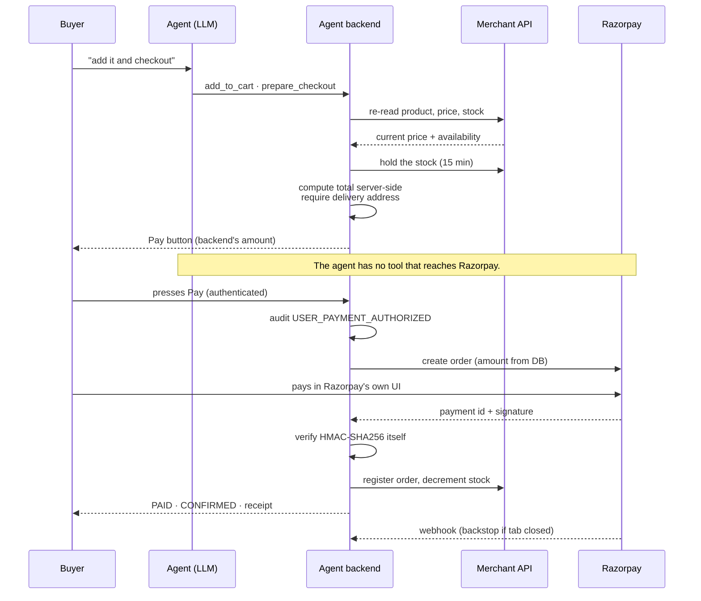

# Architecture

Two independently deployable services with **separate databases and separate
auth**, talking over a scoped HTTP API — not a monolith split into folders.

That separation is the point of the track: the merchant is transactable by an AI
buyer *because* the buyer's agent reaches it only through a public, scoped,
authenticated API. It never queries the merchant's tables.

```mermaid
flowchart TB
    subgraph Buyer
        WEB[Web chat<br/>Next.js · Clerk]
        TG[Telegram<br/>@AgenticCommerceX_bot]
    end

    subgraph AgentSvc["Agent service — buyer side"]
        API[Flask API<br/>SSE streaming]
        LOOP[Agent loop<br/>17 tools]
        ADB[(Postgres<br/>chats · carts · orders<br/>payments · audit)]
    end

    subgraph MerchantSvc["Merchant service — seller side"]
        MAPI[Flask API]
        MDB[(Postgres<br/>catalog · orders · stock)]
        DASH[Dashboard<br/>orders · payments · fulfillment]
    end

    RZP[Razorpay<br/>test mode]

    WEB --> API
    TG --> API
    API --> LOOP
    LOOP --> ADB
    LOOP -->|catalog:read · product:read| MAPI
    LOOP -->|checkout:create<br/>order sync · cancel| MAPI
    MAPI --> MDB
    DASH --> MAPI
    API -->|create order · verify · refund| RZP
    RZP -->|webhook, signature-verified| API
```

## The payment gate

The single most important path. Note where the human sits.



**Why a webhook as well as the browser callback:** browser verification only runs
if the tab is still open. Razorpay's server-to-server call is the authority.
Both converge on one idempotent function, so whichever arrives first does the
work and the other finds it done.

## Trust boundaries

| Boundary | Enforced by |
|---|---|
| Model → money | No tool exists that authorizes, captures, retries or confirms a payment |
| Client → price | Amount computed server-side from a live catalog read; request bodies ignored |
| Browser → "paid" | HMAC-SHA256 verified in-process before anything is marked `PAID` |
| Refund size | Read from the stored payment; can't exceed what was captured |
| Oversell | Holds are taken under a row lock, so concurrent checkouts serialize |
| Buyer → buyer | Every query scoped by Clerk id; order ids from users are never trusted as lookup keys |
| Telegram → account | `telegram_user_id → clerk_user_id` mapping; unlinked users get a `tg:` identity owning nothing |
| Agent → merchant DB | No connection. Scoped API key only. |

## The agent loop

A hand-written loop, not a framework runner, so every tool call can be audited and
every product card sourced from raw tool JSON.

1. Stream a completion with the 17 tool definitions
2. **Tokens stream to the client as they arrive** — but if a `tool_calls` delta
   follows text in the same round, a `retract` event withdraws it. Pre-tool
   narration is never allowed to stand as an answer.
3. Execute tools, audit each, append results, loop (max 6 rounds)
4. Persist reply + product cards + suggestions + prepared checkout + tool trace

**Product cards are built only from tool results, never parsed from the model's
prose** — so the agent cannot present a product it didn't actually look up.

The model is also grounded in the catalog's real vocabulary — every category and
brand, with live counts — and is asked to turn a need into constraints rather
than a search string. Matching a named category or brand is word-exact: plain
substring matching quietly rotted as the catalog grew, with "car" reaching Hair
**Care** and "art" reaching Sm**art**phones.

Two provider defences, both from measured behaviour rather than theory:

- A per-round wall-clock budget enforced through a background thread and a queue,
  because httpx's timeout doesn't bound a stream that keeps trickling keepalives
  (observed: a turn hung past 60s with a 20s timeout configured).
- One automatic retry per round when nothing has reached the client yet
  (measured: 6.7s, 10.4s, 40.5s and a 500 across four identical calls).

## Data model

**Agent DB** — `chat_sessions`, `chat_messages` (cards, suggestions, prepared
checkout, tool trace), `selected_products` (cart), `orders`, `payments`,
`addresses`, `buyer_profiles`, `telegram_links`, `audit_events`

**Merchant DB** — `merchants`, `stores`, `products`, `product_variants`,
`product_images`, `categories`, `orders`, `order_items`, `payments`,
`inventory_movements`, `stock_reservations`, `api_clients` + scopes,
`audit_events`

Deliberate choices:

- `orders.session_id` is `ON DELETE SET NULL`. **An order is a financial record**
  — deleting a chat must neither delete it nor be blocked by it.
- Merchant orders carry a unique `agent_order_id`, making sync idempotent: a
  retry can't double-create or double-decrement stock.
- Order line items and addresses are **snapshots**, so later edits never rewrite
  what was actually bought or where it went.
- Stock decrements on **verified payment**, not on cart-add — otherwise anyone
  could drain a merchant's inventory for free.
- Between the two, a **timed hold** covers the payment window. It is logical:
  `stock_quantity` still means "units on hand", and availability subtracts
  unexpired holds. Taking one is atomic under `SELECT … FOR UPDATE`, and expiry
  is enforced by every read filtering on the timestamp rather than by a sweeper
  — so an abandoned checkout frees its stock with no job running.

## Failure design

Every external dependency can fail, and each has a defined behaviour:

| Dependency | On failure |
|---|---|
| LLM provider | Retry once — after a short backoff if it was a 429 — then an honest fallback naming the *model* as the problem |
| Merchant catalog | Fixed message; never invents products |
| Razorpay create | Order stays unpaid; buyer told to retry |
| Razorpay verify | `PAYMENT_FAILED`; order **not** confirmed |
| Razorpay refund | Cancellation still stands; failure recorded for manual processing |
| Merchant sync | Never unwinds a paid order; recorded and retryable |
| Telegram send | HTML falls back to plain text so a reply is never silently dropped |

## Deployment

Backends on EC2 (`eu-north-1`) behind nginx with per-subdomain TLS; frontends on
Vercel; Postgres on Neon (`eu-central-1`).

The buyer app serves a public landing page at `/` and the chat at `/chat`; auth
resolves server-side so the page arrives complete rather than filling in after
hydration.

Both databases were moved from `us-east-2` to Frankfurt after measuring **126ms**
round trips from the app; Frankfurt measured **24ms**. Effect: audit writes
620ms → 117ms, catalog search 6.5s → 1.9s, chat activity indicator 1.4s → 0.28s.

SSE needs `proxy_buffering off` in nginx, and gunicorn's timeout sized above the
worst-case turn (`MAX_TOOL_ITERATIONS × REQUEST_TIMEOUT_SECONDS`).
