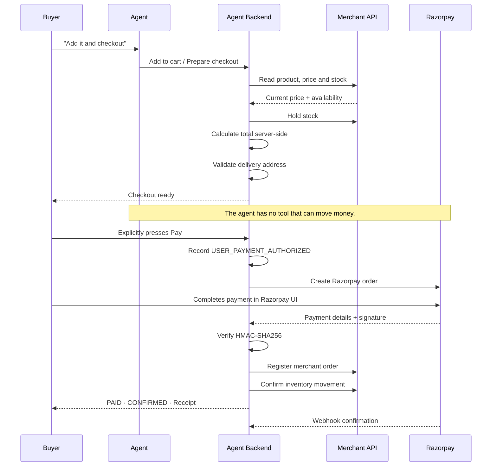

# Architecture

Agentic Commerce consists of two independently deployable services with **separate databases and separate authentication boundaries**.

The buyer's AI agent interacts with merchants through a scoped, authenticated HTTP API.

It **never directly queries the merchant's database**.

That separation is fundamental to the project: a merchant becomes transactable by an AI buyer because it exposes controlled commerce capabilities rather than giving the agent database access.

```mermaid
flowchart TB

    subgraph Buyer
        WEB[Web Chat<br/>Next.js]
        TG[Telegram<br/>@AgenticCommerceX_bot]
    end

    subgraph AgentSvc["Agent Service - Buyer Side"]
        API[Flask API<br/>Streaming]
        LOOP[Agent Loop<br/>17 Tools]
        ADB[(Postgres<br/>Chats · Carts · Orders<br/>Payments · Audit)]
    end

    subgraph MerchantSvc["Merchant Service - Seller Side"]
        MAPI[Flask API]
        MDB[(Postgres<br/>Catalog · Orders · Stock)]
        DASH[Merchant Dashboard]
    end

    RZP[Razorpay<br/>Test Mode]

    WEB --> API
    TG --> API

    API --> LOOP
    LOOP --> ADB

    LOOP -->|Catalog & Product Access| MAPI
    LOOP -->|Checkout & Order Sync| MAPI

    MAPI --> MDB
    DASH --> MAPI

    API -->|Create Order · Verify · Refund| RZP
    RZP -->|Verified Webhook| API
```

---

## The Payment Gate

The most important boundary in the system is where the human authorizes payment.



### Why Both Browser Verification and Webhooks?

The browser callback only works if the buyer remains on the page.

Razorpay's server-to-server webhook provides an additional authoritative confirmation path.

Both paths converge on the same **idempotent payment confirmation process**, meaning whichever arrives first completes the operation and the other safely detects that it has already been processed.

---

# Trust Boundaries

| Boundary                  | Enforcement                                                       |
| ------------------------- | ----------------------------------------------------------------- |
| Model → Money             | No agent tool can authorize, capture, retry, or confirm a payment |
| Client → Price            | Prices are calculated server-side from live merchant data         |
| Browser → Payment Status  | Razorpay HMAC-SHA256 verification required before `PAID`          |
| Refund Amount             | Read from stored payment and cannot exceed captured amount        |
| Overselling               | Inventory holds are acquired atomically                           |
| Buyer → Buyer             | Queries are scoped to authenticated buyer identity                |
| Telegram → Account        | Telegram identity is explicitly linked to the buyer account       |
| Agent → Merchant Database | No database connection; scoped API access only                    |

---

# The Agent Loop

The agent uses a controlled, hand-written execution loop.

This allows every tool call to be audited and prevents the UI from relying on information invented by the model.

### Flow

1. Stream the model response with the available tool definitions.
2. Stream tokens to the client.
3. Execute requested tools.
4. Audit every tool call.
5. Append tool results to the conversation.
6. Continue until the agent completes its response or reaches the maximum execution limit.
7. Persist the final response, tool trace, product cards, suggestions, and checkout state.

The loop is bounded to prevent uncontrolled execution.

---

## Product Grounding

Product cards are built directly from **tool results**.

They are never extracted from the model's prose.

This prevents the agent from presenting products it never actually retrieved.

The model is also grounded using the merchant's real:

* Categories
* Brands
* Product vocabulary

User requests are converted into structured constraints whenever possible.

For example:

```text
"I need a new mobile phone"
            ↓
category = Smartphones
```

---

## Provider Reliability

The agent handles unreliable LLM providers through:

* Per-round execution limits
* Streaming timeout protection
* One automatic retry
* Rate-limit backoff
* Honest fallback responses

If the model is unavailable, the system explicitly reports that the **AI provider is experiencing problems** rather than incorrectly claiming that the merchant catalog is unavailable.

---

# Data Model

## Agent Database

The Agent service owns:

```text
chat_sessions
chat_messages
selected_products
orders
payments
addresses
buyer_profiles
telegram_links
audit_events
```

Chat messages store additional agent state including:

* Product cards
* Suggestions
* Prepared checkout state
* Tool traces

---

## Merchant Database

The Merchant service owns:

```text
merchants
stores
products
product_variants
product_images
categories
orders
order_items
payments
inventory_movements
stock_reservations
api_clients
audit_events
```

API clients receive explicitly scoped access.

---

# Important Data Decisions

### Orders Outlive Conversations

Orders are financial records.

Deleting a chat session must never delete an order.

---

### Merchant Order Synchronization Is Idempotent

Merchant orders use a unique Agent Order ID.

Retries therefore cannot:

* Create duplicate merchant orders
* Double-decrement inventory

---

### Orders Store Snapshots

Order items and delivery addresses are stored as snapshots.

Later product or address edits cannot rewrite historical purchases.

---

### Stock Changes Only After Verified Payment

Adding an item to a cart does not reduce merchant inventory.

Inventory is finalized only after verified payment.

During checkout, a temporary hold protects the item from overselling.

```text
Cart
  ↓
No Inventory Change

Checkout
  ↓
Temporary Stock Hold

Verified Payment
  ↓
Inventory Decrement
```

---

# Inventory Holds

The system separates:

```text
Stock On Hand
        ↓
Available Stock
=
Stock On Hand
− Active Reservations
```

Reservations are:

* Time-limited
* Acquired atomically
* Protected against concurrent checkout attempts

Expired reservations automatically stop affecting availability.

An abandoned checkout therefore releases inventory without requiring a dedicated cleanup job.

---

# Failure Design

Every external dependency has a defined failure behaviour.

| Dependency               | Failure Behaviour                                                                   |
| ------------------------ | ----------------------------------------------------------------------------------- |
| LLM Provider             | Retry once, optionally back off after rate limiting, then return an honest fallback |
| Merchant Catalog         | Never invent products; return a controlled error                                    |
| Razorpay Order Creation  | Order remains unpaid and buyer can retry                                            |
| Razorpay Verification    | `PAYMENT_FAILED`; order is not confirmed                                            |
| Razorpay Refund          | Cancellation remains valid and failure is recorded for manual handling              |
| Merchant Synchronization | Paid order is preserved; synchronization failure is retryable                       |
| Telegram Delivery        | Formatting fallback prevents replies from being silently dropped                    |

---

# Core Architectural Principle

```text
AI Agent
   │
   ├── Can search
   ├── Can recommend
   ├── Can build carts
   ├── Can prepare checkout
   │
   └── Cannot move money
              │
              ▼
        Explicit Human Action
              │
              ▼
           Razorpay
              │
              ▼
     Server-Side Verification
              │
              ▼
       Order Confirmation
```

> **The AI agent can operate the shopping workflow.**
>
> **The human authorizes payment.**
>
> **The backend verifies the result.**

The payment boundary is enforced by the architecture itself, not by asking the model to behave.
